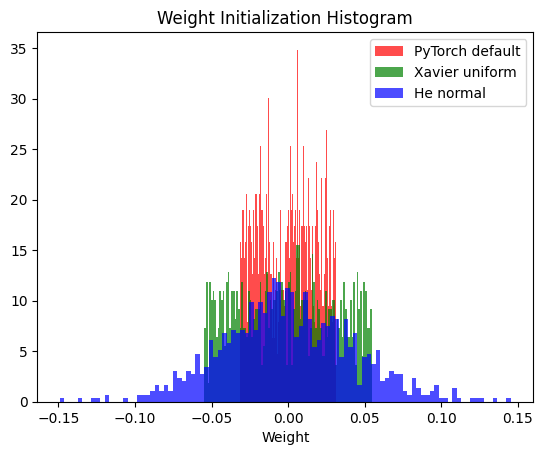
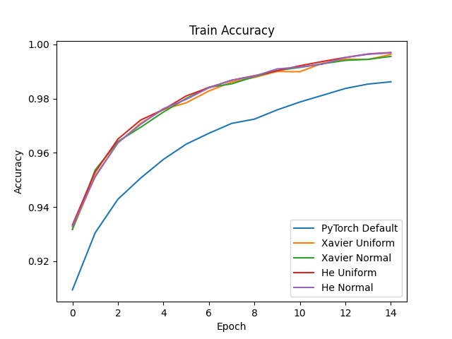
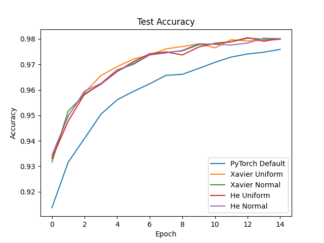

# Experimenting with Initialization
This is an experiment on weight initialization. I noticed that PyTorch doesn't actually default initialize linear layers to Xavier or He initialization, which seemed pretty weird to me. Here's a plot of the weights for a model with each of the three strategies.

Here's the train/test accuracy for the different initializations I tried.

